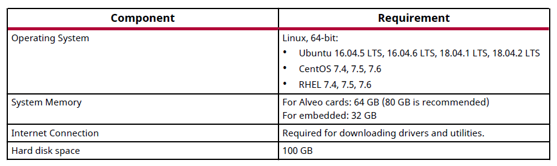
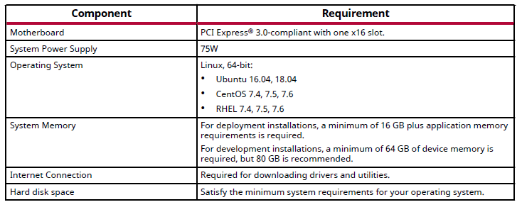

[toc]
   
# 说明

您需要同时拥有开发环境和部署环境。开发环境需要安装VITIS，性能需求高于部署环境，您可以在远程服务器上建立开发环境，主机端建立部署环境。您也可以在一台机器上同时安装部署环境和开发环境，对于条件满足最大需求即可。

开发环境最低要求如下图，可参考 [UG1393](https://www.xilinx.com/support/documentation/sw_manuals/xilinx2020_1/ug1393-vitis-application-acceleration.pdf)

<center></center>

部署环境最低要求如下图，可参考 [UG1370](https://www.xilinx.com/support/documentation/boards_and_kits/accelerator-cards/1_6/ug1370-u50-installation.pdf)

<center></center>

笔者使用的环境如下

开发环境：Ubuntu 18.04 , Vitis 2020.1,

部署环境：Ubuntu 16.04 , Alveo u50 , XRT 202010.2.6.655,xdma xilinx_u50_gen3x16_xdma_201920.3

作者：Yunfeng Xu

邮件：yunfengx@xilinx.com

# 在部署环境上安装Alveo U50 Cards


## 卡安装

​    卡安装流程详细信息可参考[UG1370](https://www.xilinx.com/support/documentation/boards_and_kits/accelerator-cards/1_6/ug1370-u50-installation.pdf)

1. 关闭主机电源，打开电脑外壳

2. 将Alveo U50卡插上PCIex16插槽

3. 安装外壳，插上电源，重新启动计算机

4. 验证器件是否正常安装，在终端输入以下命令

   ```shell
   sudo lspci -vd 10ee:
   ```

   如果正确安装，并被操作系统找到，则会显示如下信息

   ```bash
   01:00.0 Processing accelerators: Xilinx Corporation Device 5020
   	Subsystem: Xilinx Corporation Device 000e
   	Flags: bus master, fast devsel, latency 0
   	Memory at f2000000 (64-bit, prefetchable) [size=32M]
   	Memory at f4020000 (64-bit, prefetchable) [size=128K]
   	Capabilities: [40] Power Management version 3
   	Capabilities: [60] MSI-X: Enable+ Count=32 Masked-
   	Capabilities: [70] Express Endpoint, MSI 00
   	Capabilities: [100] Advanced Error Reporting
   	Capabilities: [1c0] #19
   	Capabilities: [e00] Access Control Services
   	Capabilities: [e10] #15
   	Capabilities: [e80] Vendor Specific Information: ID=0020 Rev=0 Len=010 <?>
   	Kernel driver in use: xclmgmt
   	Kernel modules: xclmgmt
   ```

## Ubuntu 上的 XRT 和部署平台安装

1.  [Alveo U50 产品页面的“入门”选项卡](https://www.xilinx.com/products/boards-and-kits/alveo/u50.html#gettingStarted)提供了XRT安装包和部署安装文件，选择您的操作系统和版本，下载赛灵思 XRT (Xilinx Runtime) 安装包文件

2. 通过在安装包所在目录中运行以下命令来安装 XRT 安装包。<version> 是安装包文件名的后半部分。

   ```bash
   sudo apt install ./xrt_<version>.deb
   ```

3. 从 [Alveo U50 产品页面的“入门”选项卡](https://www.xilinx.com/products/boards-and-kits/alveo/u50.html#gettingStarted)下选择您的操作系统和版本，下载并解压部署安装 tar.gz 文件

4. 安装部署包。在安装包解压到的目录中，运行以下命令，安装所有部署包。

   ```
   sudo apt install ./*.deb
   ```

   安装完成之后，您将看到以下信息：

   ```bash
   Partition package installed successfully.
   Please flash card manually by running below command:
   sudo /opt/xilinx/xrt/bin/xbmgmt flash --update --shell <shell_name>
   ```

5. 将上面显示的命令复制到终端中运行一下，格式如下

   ```
   sudo /opt/xilinx/xrt/bin/xbmgmt flash --update --shell <shell_name>
   ```

6. 系统将要求您确认更新，如下所示。输入“y”并按“Enter”键以刷新固件。

   ```
   Status: shell needs updating
   Current shell: <current_platform_name>
   Shell to be flashed: <platform_to_be_flashed>
   Are you sure you wish to proceed? [y/n]:
   ```

7. 成功完成新卡刷写后，将显示如下消息。

   ```bash
   Updating shell on card[0000:73:00.0]
   INFO: ***Found 351 ELA Records
   Enabled bitstream guard. Bitstream will not be loaded until flashing is
   finished.
   Erasing flash........................
   Programming flash........................
   Cleared bitstream guard. Bitstream now active.
   Successfully flashed Card[0000:65:00.0]
   1 Card(s) flashed successfully.
   Cold reboot machine to load the new image on card(s)
   ```

8. 冷启动您的机器，将新固件镜像加载到 FPGA。

9. 重新运行前述更新步骤中的更新命令以更新 SC 固件。

   ```bash
   sudo /opt/xilinx/xrt/bin/xbmgmt flash --update --shell <shell_name>
   ```

10. 如果 SC 处于最新状态，将看到以下信息。

    ```
    Status: shell is up-to-date
    Card(s) up-to-date and do not need to be flashed.
    ```

## 卡初始化与验证

完成 XRT 和部署平台安装后，可使用下列命令验证卡安装，命令的详细说明如下。

- lspci
- xbmgmt flash --scan
- xbutil validate

运行以下命令设置环境以便使用这些实用工具

```bash
source /opt/xilinx/xrt/setup.sh
```

### 运行 lspci

输入以下命令

```bash
sudo lspci -vd 10ee:
```

如果卡安装成功并被发现，您将看到以下信息

```bash
01:00.0 Processing accelerators: Xilinx Corporation Device 5020
Subsystem: Xilinx Corporation Device 000e
Flags: bus master, fast devsel, latency 0
Memory at 38bff2000000 (64-bit, prefetchable) [size=32M]
Memory at 38bff4020000 (64-bit, prefetchable) [size=128K]
Capabilities: [40] Power Management version 3
Capabilities: [60] MSI-X: Enable+ Count=32 Masked-
Capabilities: [70] Express Endpoint, MSI 00
Capabilities: [100] Advanced Error Reporting
Capabilities: [1c0] #19
Capabilities: [e00] Access Control Services
Capabilities: [e10] #15
Capabilities: [e80] Vendor Specific Information: ID=0020 Rev=0
Len=010 <?>
Kernel driver in use: xclmgmt
Kernel modules: xclmgmt
01:00.1 Processing accelerators: Xilinx Corporation Device 5021
Subsystem: Xilinx Corporation Device 000e
Flags: bus master, fast devsel, latency 0, IRQ 183
Memory at 38bff0000000 (64-bit, prefetchable) [size=32M]
Memory at 38bff4000000 (64-bit, prefetchable) [size=128K]
Memory at 38bfe0000000 (64-bit, prefetchable) [size=256M]
Capabilities: [40] Power Management version 3
Capabilities: [60] MSI-X: Enable+ Count=32 Masked-
Capabilities: [70] Express Endpoint, MSI 00
Capabilities: [100] Advanced Error Reporting
Capabilities: [e00] Access Control Services
Capabilities: [e10] #15
Capabilities: [e80] Vendor Specific Information: ID=0020 Rev=0
Len=010 <?>
Kernel driver in use: xocl
Kernel modules: xocl
```

### 运行 xbmgmt flash --scan

使用 xbmgmt flash --scan 命令查看并验证该卡的当前固件版本，并显示已安装的卡的详情，包括卡 BDF、平台名称和时间戳

输入以下命令：

```
sudo /opt/xilinx/xrt/bin/xbmgmt flash --scan
```

显示与以下示例类似的输出结果

```bash
Card [0000:01:00.0]
    Card type:		u50
    Flash type:		SPI
    Flashable partition running on FPGA:
        xilinx_u50_gen3x16_xdma_201920_3,[ID=0xf465b0a3ae8c64f6],[SC=5.0.27]
    Flashable partitions installed in system:	
        xilinx_u50_gen3x16_xdma_201920_3,[ID=0xf465b0a3ae8c64f6],[SC=5.0.27]
```

FPGA 与系统中的平台完全相同，部署平台名为xilinx_u50_gen3x16_xdma_201920_3

### xbutil validate

xbutil validate 命令通过执行下列测试来验证安装是否正确。
1. 验证发现的器件。
2. 检查 PCIe 链接状态。
3. 在卡上运行验证内核。
4. 执行下列数据带宽测试：
a. DMA 测试：通过 PCIe 在主机和 FPGA DDR 间传输数据。
b. DDR 测试 - 内核与 FPGA DDR 间的数据传输。

运行验证命令，如下所示：

```bash
/opt/xilinx/xrt/bin/xbutil validate
```

如果该卡安装正确，将输出与以下类似的结果

```bash
INFO: Found 1 cards
INFO: Validating card[0]: xilinx_u50_gen3x16_xdma_201920_3
INFO: == Starting AUX power connector check:
AUX power connector not available. Skipping validation
INFO: == AUX power connector check SKIPPED
INFO: == Starting PCIE link check:
INFO: == PCIE link check PASSED
INFO: == Starting SC firmware version check:
INFO: == SC firmware version check PASSED
INFO: == Starting verify kernel test:
INFO: == verify kernel test PASSED
INFO: == Starting DMA test:
Host -> PCIe -> FPGA write bandwidth = 11933.1 MB/s
Host <- PCIe <- FPGA read bandwidth = 11966.5 MB/s
INFO: == DMA test PASSED
INFO: == Starting device memory bandwidth test:
...........
Maximum throughput: 52428 MB/s
INFO: == device memory bandwidth test PASSED
INFO: == Starting PCIE peer-to-peer test:
P2P BAR is not enabled. Skipping validation
INFO: == PCIE peer-to-peer test SKIPPED
INFO: == Starting memory-to-memory DMA test:
M2M is not available. Skipping validation
INFO: == memory-to-memory DMA test SKIPPED
INFO: Card[0] validated successfully.
INFO: All cards validated successfully.
```

至此，XRT 和部署平台安装的步骤就已经完成了。如果在后续实验中发现，XRT 和部署平台的版本不合适，可参考下一节变更XRT与目标平台的版本

## 变更XRT与目标平台的版本

变更XRT与目标平台的版本应先卸载再安装新的版本。其他版本的资源您可以在[package-files-archive页面](https://www.xilinx.com/products/boards-and-kits/alveo/package-files-archive.html)下载

1. 列出当前安装的部署平台软件包

   ```bash
   apt list –-installed | grep xilinx
   ```

   您将看到以下类似的结果

   ```bash
   xilinx-cmc-u50/now 1.0.17-2784148 all [已安装，本地]
   xilinx-sc-fw-u50/now 5.0.27-2.e289be9 all [已安装，本地]
   xilinx-u50-gen3x16-xdma-blp/now 1-2784799 all [已安装，本地]
   ```

2. 列出当前安装的 XRT 软件包，请在 Linux 终端中运行以下命令：

   ```bash
   apt list -–installed | grep xrt
   ```
   您将看到以下类似的结果
   ```shell
   xrt/now 2.6.655 amd64 [已安装，本地]
   ```

3. 卸载软件包

   根据 [UG1370](https://www.xilinx.com/support/documentation/boards_and_kits/accelerator-cards/1_6/ug1370-u50-installation.pdf)给出的方法是在 Linux 终端中运行以下命令。卸载 XRT 同时也会卸载部署平台。

   ```
   sudo apt remove ./<xrt_package_name>
   ```

   实际上，笔者尝试上述方法，卸载失败。我们在卸载的时候请使用以下命令：

   ```bash
   sudo apt remove xrt
   ```

   卸载完成之后再重复1~2，查看软件包是否卸载完成。确认完成之后再重新安装新版本XRT与部署平台。

## 问题：卸载XRT再安装新版本XRT会卡住

1. 笔者在变更XRT版本时遇到如下问题。在卸载XRT然后重新安装新版本的XRT时,进度条一直卡在66%不变，现给出解决过程仅供参考。


2. 由于一直卡住，尝试使用**Ctrl+C** 强制停止。无反应，强制关机。

3. 在断电情况下拔下U50板卡，再接上电源重新开机。

4. 在终端输入以下命令进行修复。

   ```
   sudo dpkg --configure -a
   ```

5. 使用以下命令查询xrt安装情况

   ```
   apt list --installed | grep xrt
   ```

   ```
   apt list --installed | grep xilinx
   ```

   如果无相关显示则表明xrt已下载完全。若显示xrt已安装，则执行以下命令卸载

   ```
   sudo apt remove xrt
   ```

6. 再插上U50重新开机安装xrt和xdma。(也可以尝试先安装再插上U50,再测试)

# 在部署环境上安装PYNQ

## 要求

在部署平台上安装PYNQ请参考[PYNQ docs主页](https://pynq.readthedocs.io/en/latest/getting_started/alveo_getting_started.html)

在Alveo上安装PYNQ要求：

- XRT>=2.3
- Python>=3.6

如果您的XRT版本不符合要求,请参考 [变更XRT与目标平台的版本](#变更XRT与目标平台的版本)这节变更XRT版本，如果您的Python版本不符合要求，请参考[更改默认Python版本](#更改默认Python版本)这节更改您默认的python版本。

## 安装PYNQ

1. 通过PIP 安装pynq。

   ```bash
   pip install pynq
   ```

   如出现pip错误，请参考[这篇博客](https://blog.csdn.net/qq_21437451/article/details/81490932)解决。

2. 使用PIP 安装入门提示

   ```
   pip install pynq-alveo-examples
   ```

3. 在Shell会话中运行命令

   ```bash
   pynq get-notebooks
   ```

4. 每个会话之前，您要做的第一件事是获取XRT设置脚本。为此，打开一个bash shell并输入

   ```
   source /opt/xilinx/xrt/setup.sh
   ```

   该路径`/opt/xilinx/xrt`是XRT的预定义安装路径，不应更改

5. 运行Jupyter

   ```bash
   cd pynq-notebooks
   jupyter notebook
   ```

6. 打开welcome-to-pynq.ipynb 文件，您将看到

   

   运行将看到部署平台的信息。笔者这显示的是

   ```shel
   0) xilinx_u50_gen3x16_xdma_201920_3
   ```

7. 在Alveo-PYNQ文件夹保存的pynq-alveo的例子。以第一节*1_introduction*举例，该文件夹中包含了4个.ipynb文件，以及一个intro.xclbin.link文件

   intro.xclbin.link文件可以直接打开，里面保存了一些overlay的下载地址

   ```
   {
       "xilinx_u200_xdma_201830_2": {
           "url": "http://bit.ly/2SzJB81",
           "md5sum": "e5d165118c9e827b61824c95e9a3fac5"
       },
       "xilinx_u250_xdma_201830_2": {
           "url": "http://bit.ly/38zNGP0",
           "md5sum": "afb159e56cf895fe4781dfba61818f28"
       },
       "xilinx_u280_xdma_201920_1": {
           "url": "http://bit.ly/37w7gdU",
           "md5sum": "baca46738470c4ecb3e93666159a36de"
       },
       "xilinx_u50_xdma_201920_1": {
           "url": "http://bit.ly/2SAZmf7",
           "md5sum": "6420b104b7df5c37a6e12f976659218e"
       },
       "xilinx_aws-vu9p-f1_dynamic_5_0": {
           "url": "http://bit.ly/2Pc3xeW",
           "md5sum": "ad66c90ae823455c90e8e4609f154c79"
       }
   }
   ```

   复制链接地址到浏览器打开可直接下载该overlay

8. 对于U50，只提供了xdma_201920_1平台的示例文件，如果不符合您安装版本，或者需要自定义overlay请往下继续进行

## 问题:更改默认Python版本

系统默认pytho版本是2.7,不符合安装要求（最低3.5），于是升级到3.7。

1. 升级过程请参考[这篇博客](https://blog.csdn.net/u014775723/article/details/85213793)
2. 安装过程如遇No module named ‘_ctypes’错误，请参考[这篇博客](https://blog.csdn.net/u014775723/article/details/85224447)解决。

# 在开发环境上安装VITIS

## 安装要求


## 安装Vitis

1. 您可以从[xilinx下载网站](https://www.xilinx.com/support/download/index.html/content/xilinx/en/downloadNav/vitis.html)下载Vitis
2. Vitis安装可参考 [UG1393](https://www.xilinx.com/support/documentation/sw_manuals/xilinx2020_1/ug1393-vitis-application-acceleration.pdf)第16页
   1. Go to the Xilinx Downloads Website.
   2. Download the installer for your operating system.
   3. Run the installer, which opens the Xilinx Unified 2019.2 Installer.
   4. Click Next.
   5. Enter your Xilinx user account credentials, and then select Download and Install Now.
   6. Click Next.
   7. Accept the terms and conditions by clicking each I Agree check box.
   8. Click Next.
   9. Select Vitis, and then click Next.
   10. Optionally, customize your installation by selecting design tools and devices, and then click
       Next.
       IMPORTANT! Do not deselect the following option. It is required for installation.
       • Devices → Install devices for Alveo and Xilinx Edge acceleration platforms
       Note: Both the Vitis tools and Vivado Design Suite are installed. You do not need to separately install
       Vivado tools. You can also install System Generator and Model Composer if needed.
   11. Select the installation directory, optional shortcut and file association options, and then click
       Next.
   12. Review the installation summary, which shows the options and locations you have selected.
   13. To proceed with the installation of the Vitis software platform, click Install.
       After a successful installation, a confirmation message is displayed.

## 安装Xilinx Runtime

1. 根据您的ubuntu版本下载Xilinx Runtime,其他版本的资源您可以在[package-files-archive页面](https://www.xilinx.com/products/boards-and-kits/alveo/package-files-archive.html)下载

   [Ubuntu 16.04](https://xilinx-ax-dl.entitlenow.com/dl/ul/2019/10/29/R210258839/xrt_201920.2.3.1301_16.04-xrt.deb/e0ace41a1b5fe3aaa905ed32f4457c9c/5F0A2867?akdm=0&filename=xrt_201920.2.3.1301_16.04-xrt.deb)
   [Ubuntu 18.04](https://xilinx-ax-dl.entitlenow.com/dl/ul/2019/10/29/R210258842/xrt_201920.2.3.1301_18.04-xrt.deb/273ea0426010c8b2016d450f5a7c89ed/5F0A298A?akdm=0&filename=xrt_201920.2.3.1301_18.04-xrt.deb)

2. 使用以下命令进行安装

   ```
   sudo apt install <deb-dir>/<xrt_filename_OS>.deb
   ```

## 安装Platforms

1. 您可以从[Alveo u50介绍页](https://www.xilinx.com/products/boards-and-kits/alveo/u50.html#gettingStarted)下载 Platforms文件,其他版本的资源您可以在[package-files-archive页面](https://www.xilinx.com/products/boards-and-kits/alveo/package-files-archive.html)下载

2. 使用以下命令进行安装

  ```
  sudo apt install <deb-dir>/<development_shell_filename_OS>.deb
  ```

## 设置运行Vitis的运行环境

```
#setup XILINX_VITIS and XILINX_VIVADO variables
source <Vitis_install_path>/Vitis/2019.2/settings64.sh
#setup XILINX_XRT
source /opt/xilinx/xrt/setup.sh
```

```
export PLATFORM_REPO_PATHS=<path to platforms>
```

# 自定义overlay

您可以访问[Vitis Accel示例库](https://github.com/Xilinx/Vitis_Accel_Examples)。该存储库包含一些示例，以展示Vitis工具和平台的各种功能。该存储库通过一些小的示例说明了与主机代码和内核编程有关的特定方案。笔者将以其中的[hello world程序](https://github.com/Xilinx/Vitis_Accel_Examples/tree/master/hello_world)为例构建overlay文件，在pynq上运行。

## 生成overlay

### 方法一:使用示例库编译指令

1. 将示例库下载到本地

   ```bash
   git clone https://github.com/Xilinx/Vitis_Accel_Examples.git
   ```

2. 进入hello word文件夹

   ```bash
   cd hello_world/
   ```

3. 执行make help可以得到编译指令的用法

   ```make
   make help
   ```

   得到如下信息

   ```makefile
   Makefile Usage:
     make all TARGET=<sw_emu/hw_emu/hw> DEVICE=<FPGA platform> HOST_ARCH=<aarch32/aarch64/x86> EDGE_COMMON_SW=<rootfs and kernel image path>
         Command to generate the design for specified Target and Shell.
         By default, HOST_ARCH=x86. HOST_ARCH and EDGE_COMMON_SW is required for SoC shells
   
     make clean 
         Command to remove the generated non-hardware files.
   
     make cleanall
         Command to remove all the generated files.
   
     make test DEVICE=<FPGA platform>
        Command to run the application. This is same as 'check' target but does not have any makefile dependency.
   
     make sd_card TARGET=<sw_emu/hw_emu/hw> DEVICE=<FPGA platform> HOST_ARCH=<aarch32/aarch64/x86> EDGE_COMMON_SW=<rootfs and kernel image path>
         Command to prepare sd_card files.
         By default, HOST_ARCH=x86. HOST_ARCH and EDGE_COMMON_SW is required for SoC shells
   
     make check TARGET=<sw_emu/hw_emu/hw> DEVICE=<FPGA platform> HOST_ARCH=<aarch32/aarch64/x86> EDGE_COMMON_SW=<rootfs and kernel image path>
         Command to run application in emulation.
         By default, HOST_ARCH=x86. HOST_ARCH and EDGE_COMMON_SW is required for SoC shells
   
     make build TARGET=<sw_emu/hw_emu/hw> DEVICE=<FPGA platform> HOST_ARCH=<aarch32/aarch64/x86> EDGE_COMMON_SW=<rootfs and kernel image path>
         Command to build xclbin application.
         By default, HOST_ARCH=x86. HOST_ARCH and EDGE_COMMON_SW is required for SoC shells
   ```

4. 这里我们使用指令make build DEVICE=<FPGA platform>进行编译

   ```
   make build DEVICE=xilinx_u50_gen3x16_xdma_201920_3
   ```

   请确保您的vitis,xrt,platform安装正确，否则都会导致编译失败。

5. 最后得到.xclbin文件

   


### 方法二:使用vitis编译指令

1. 创建vadd.c文件

   ```c
   void vadd(const unsigned int* in_a, const unsigned int* in_b, unsigned int * out_c, int count) {
   #pragma HLS INTERFACE m_axi port=in_a offset=slave
   #pragma HLS INTERFACE m_axi port=in_b offset=slave
   #pragma HLS INTERFACE m_axi port=out_c offset=slave
       for (int i = 0; i < count; ++i) {
           *out_c++ = *in_a++ + *in_b++;
       }
   }
   ```
   
2. 使用指令生成内核文件

   ```bash
   v++ -c vadd.c -t hw --kernel vadd -f $platform -o vadd.xo
   ```

   其中$platform是您的platform路径，如果不知道路径可以通过[问题：如何找到platform安装路径](#问题：如何找到platform安装路径)找到您的platform。笔者用到的指令是：

   ```shell
   v++ -c vadd.c -t hw --kernel vadd -f /proj/xbuilds/CustTA/2020.1_0602_1458/internal_platforms/xilinx_u50_gen3x16_xdma_2020_3/xilinx_u50_gen3x16_xdma_2020_3.xpfm -o vadd.xo
   ```
   
3. 生成.xclbin文件

   ```bash
   v++ -l -t hw -o vadd.xclbin -f $platform vadd.xo
   ```

   
## 运行

1. 将开发平台生成的.xclbin文件转移到部署平台上，您可以使用[WinSCP](https://winscp.net/eng/download.php)实现

2. 在部署平台上打开PYNQ工具 jupyter

   ```bash
   source /opt/xilinx/xrt/setup.sh
   cd pynq-notebooks
   jupyter notebook
   ```

3. 将.xclbin文件放到1_introduction文件夹下，并命名为vadd.xclbin

4. 打开1-vector-addition.ipynb文件，逐句执行即可。

5. 观察结果。如果执行出现错误请查看是否是本节中已列出来的错误。

   

   

## 问题:如何找到platform安装路径

1. 打开vitis

   

2. 选择Create Application Project

   

3. 点击Next

   

4. 搜索u50

   

5. 即会显示当前安装的与u50有关的platform,本次实验中，笔者用到的platform,名字为：xilinx_u50_gen3x16_xdma_201920_3 ,路径为:/proj/xbuilds/CustTA/2020.1_0602_1458/internal_platforms/xilinx_u50_gen3x16_xdma_2020_3/xilinx_u50_gen3x16_xdma_2020_3.xpfm

## 问题:.xclbin文件载入[Errno 95] Operation not supported

出现如下错误


推测是部署平台与生成.xclbin时指定的平台不一致导致。请重新生成

## 问题:TypeError: buffer is too small for requested array

执行


出现


请参考[PYNQ support](https://discuss.pynq.io/t/pynq-on-alveo-typeerror-buffer-is-too-small-for-requested-array/1441)解决。

1. 将 /home/xilinx/.local/lib/python3.7/site-packages/pynq/pl_server/xrt_device.py文件

   

   改成

   

2. 将

   

   改成

   
## 问题:RuntimeError:Struct string generation failed

载入.xclbin文件时出现如下错误


打开编译时产生的文件可以看到


其中count的偏移地址与in_a相同导致。请确保端口定义正确。只能定义一个s_axilite接口.

可以将代码

```c
void vadd(int* in_a, int* in_b, int* out_c, int count) {
#pragma HLS INTERFACE m_axi port=in_a offset=slave
#pragma HLS INTERFACE m_axi port=in_b offset=slave
#pragma HLS INTERFACE m_axi port=out_c offset=slave
#pragma HLS INTERFACE s_axilite port=count bundle=control
#pragma HLS INTERFACE s_axilite port=return bundle=control
    for (int i = 0; i < count; ++i) {
        *out_c++ = *in_a++ + *in_b++;
    }
}
```
改成
```c
void vadd(const unsigned int* in_a, const unsigned int* in_b, unsigned int * out_c, int count) {
#pragma HLS INTERFACE m_axi port=in_a offset=slave
#pragma HLS INTERFACE m_axi port=in_b offset=slave
#pragma HLS INTERFACE m_axi port=out_c offset=slave
    for (int i = 0; i < count; ++i) {
        *out_c++ = *in_a++ + *in_b++;
    }
}
```
解决


